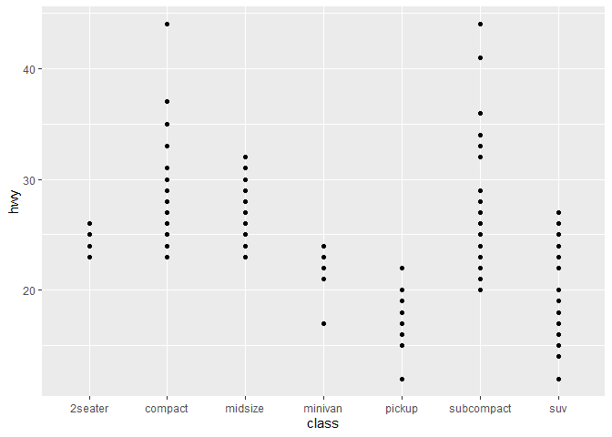
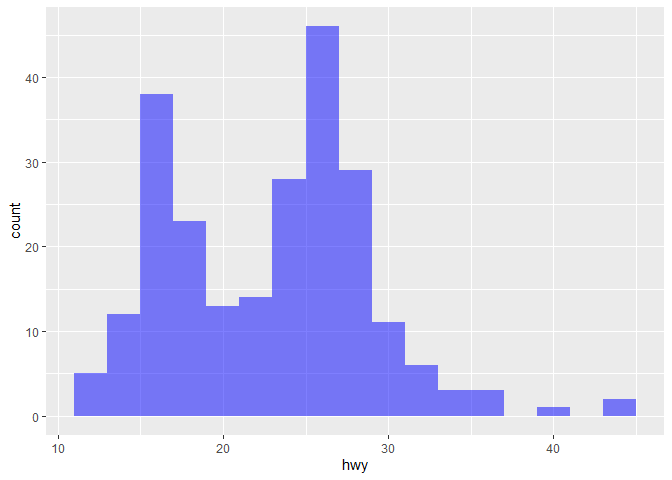
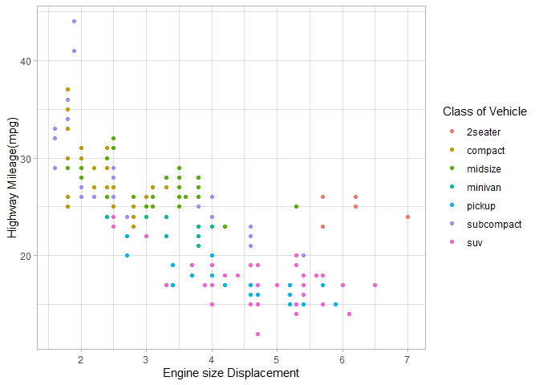
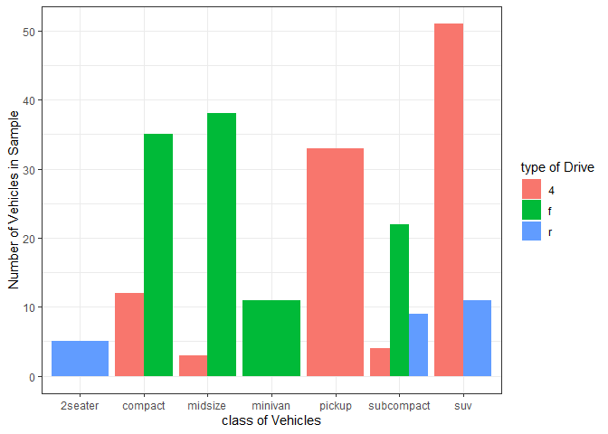

# Visualize Data
Dhruv Salian

<!-- If you get the error "Error in list2(na.rm = na.rm, ...) : object 'ffi_list2' not found" do the following in the Console run:  
&#10;    remove.packages("rlang")
&#10;Then Restart R to be safe. Then run:
&#10;    install.packages("rlang")
&#10;and again restart R to be safe. That should fix the problem (which is a package dependency issue).   -->

Try your code again

## Your Turn 0

Add a setup chunk that loads the tidyverse packages.

``` r
head(mpg)
```

    # A tibble: 6 × 11
      manufacturer model displ  year   cyl trans      drv     cty   hwy fl    class 
      <chr>        <chr> <dbl> <int> <int> <chr>      <chr> <int> <int> <chr> <chr> 
    1 audi         a4      1.8  1999     4 auto(l5)   f        18    29 p     compa…
    2 audi         a4      1.8  1999     4 manual(m5) f        21    29 p     compa…
    3 audi         a4      2    2008     4 manual(m6) f        20    31 p     compa…
    4 audi         a4      2    2008     4 auto(av)   f        21    30 p     compa…
    5 audi         a4      2.8  1999     6 auto(l5)   f        16    26 p     compa…
    6 audi         a4      2.8  1999     6 manual(m5) f        18    26 p     compa…

## Your Turn 1

Run the code on the slide to make a graph. Pay strict attention to
spelling, capitalization, and parentheses!

``` r
ggplot(data = mpg)+
  geom_point(mapping = aes(x = displ, y = hwy))
```


## Your Turn 2

Replace this scatterplot with one that draws boxplots. Use the
cheatsheet. Try your best guess.

``` r
ggplot(data = mpg) +
  geom_point(mapping = aes(x = class, y = hwy))
```



## Your Turn 3

Make a histogram of the `hwy` variable from `mpg`. Hint: do not supply a
y variable.

``` r
ggplot(mpg) +
  geom_histogram(aes(x = hwy),binwidth = 2)
```


## Your Turn 4

Use the help page for `geom_histogram` to make the bins 2 units wide.

``` r
ggplot(mpg) +
  geom_histogram(aes(x = hwy),
                 alpha=0.5,
                 binwidth = 2,
                 fill="blue")
```



## Your Turn 5

Add `color`, `size`, `alpha`, and `shape` aesthetics to your graph.
Experiment.

``` r
ggplot(data = mpg) +
  geom_point(mapping = aes(x = displ, 
                           y = hwy,
                           color=class))+
  labs(x="Engine size Displacement",
       y="Highway Mileage(mpg)",
       color="Class of Vehicle",
       Title="The bigger the engine the less mileage we get on highway")+
         theme_light()
```

    Ignoring unknown labels:
    • Title : "The bigger the engine the less mileage we get on highway"



## Help Me

What do `facet_grid()` and `facet_wrap()` do? (run the code, interpret,
convince your group)

``` r
# Makes a plot that the commands below will modify
q <- ggplot(mpg) + geom_point(aes(x = displ, y = hwy))

q + facet_grid(. ~ cyl)
```


``` r
q + facet_grid(drv ~ .)
```


``` r
q + facet_grid(drv ~ cyl)
```


``` r
q + facet_wrap(~ class)
```


## Your Turn 6

Make a bar chart `class` colored by `class`. Use the help page for
`geom_bar` to choose a “color” aesthetic for class.

``` r
ggplot(data = mpg) +
  geom_bar(aes(x = class, fill=drv),
           position=position_dodge())+
  labs(x="class of Vehicles",
       y="Number of Vehicles in Sample",
       fill="type of Drive")+
  theme_bw()
```



## Quiz

What will this code do?

``` r
ggplot(mpg,aes(x=displ, y=hwy)) + 
  geom_point(aes(color=class)) +
  geom_smooth(color="black",
              se= FALSE,
              method="lm") 
```

    `geom_smooth()` using formula = 'y ~ x'


``` r
scale_color_viridis_d()
```

    <ggproto object: Class ScaleDiscrete, Scale, gg>
        aesthetics: colour
        axis_order: function
        break_info: function
        break_positions: function
        breaks: waiver
        call: call
        clone: function
        dimension: function
        drop: TRUE
        expand: waiver
        fallback_palette: function
        get_breaks: function
        get_breaks_minor: function
        get_labels: function
        get_limits: function
        get_transformation: function
        guide: legend
        is_discrete: function
        is_empty: function
        labels: waiver
        limits: NULL
        make_sec_title: function
        make_title: function
        map: function
        map_df: function
        minor_breaks: waiver
        n.breaks.cache: NULL
        na.translate: TRUE
        na.value: NA
        name: waiver
        palette: function
        palette.cache: NULL
        position: left
        range: environment
        rescale: function
        reset: function
        train: function
        train_df: function
        transform: function
        transform_df: function
        super:  <ggproto object: Class ScaleDiscrete, Scale, gg>

``` r
 ggsave("example.jpg",width=6, height=4)
```

    `geom_smooth()` using formula = 'y ~ x'

------------------------------------------------------------------------

# Take aways

You can use this starter code template to make thousands of graphs with
**ggplot2**.

``` r
ggplot(data = <DATA>) +
  <GEOM_FUNCTION>(mapping = aes(<MAPPINGS>))
```
